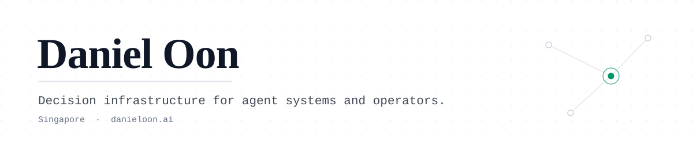

<picture>
  <source media="(prefers-color-scheme: dark)" srcset="assets/banner-dark.svg">
  <source media="(prefers-color-scheme: light)" srcset="assets/banner-light.svg">
  
</picture>

[Website](https://danieloon.ai) · [LinkedIn](https://www.linkedin.com/in/danieloon) · [@EauDoon](https://x.com/EauDoon)

I build tools that make agent actions and business decisions easier to inspect, question, and replay.

## Selected work

### [MandateBound](https://github.com/EauDoon/mandatebound)

**Evidence review for agent-assisted purchases.** An experimental engine that replays disputes from supplied records and returns unresolved when evidence is missing, invalid, or conflicting.

[Read the evidence case →](https://github.com/EauDoon/mandatebound/blob/main/docs/CASE_STUDY.md)

### [Decision Labs](https://github.com/EauDoon/decision-labs)

**Business decisions with the assumptions visible.** Four local browser workbenches for partnership thresholds, pooled buying, structured agreements, and weekend liquidity.

[Walk through a partnership decision →](https://github.com/EauDoon/decision-labs/blob/main/docs/CASE_STUDY.md)

### [Hermes Parallel Follow-ups](https://github.com/EauDoon/hermes-parallel-followups)

**Separate messages, predictable execution.** Reversible patches for a documented Hermes source revision, with bounded concurrency and cancellation tests.

[Explore the debugging case →](https://github.com/EauDoon/hermes-parallel-followups/blob/main/docs/CASE_STUDY.md)

These worked cases use synthetic inputs. They demonstrate specific checks, not customer adoption, production reliability, or business impact.

## More to explore

<strong>Browse the project index</strong>

### Agent infrastructure

- **[Agent Action Stack](https://github.com/EauDoon/agent-action-stack)** connects policy checks, action recovery, and dispute evidence in a runnable synthetic reference path.
- **[Consequence Rail](https://github.com/EauDoon/consequence-rail)** provides recourse-gated execution, recovery preflight, and signed settlement receipts.
- **[Constitutional Agent Testbench](https://github.com/EauDoon/constitutional-agent-testbench)** checks structured agent responses against policy rules with deterministic precedence traces.
- **[Agent Team](https://github.com/EauDoon/agent-team-os)** is a reusable skill for bounded specialist workflows, evidence handoffs, and independent review.

### Decision methods

- **[Unconventional Moves](https://github.com/EauDoon/unconventional-moves)** is a decision skill for comparing practical approaches and planning reversible experiments.
- **[Crypto Research Desk](https://github.com/EauDoon/crypto-research-desk)** combines research-only workflows with a browser workbench for evidence packets and independent risk review.

### Experiments and examples

- **[Operator Labs](https://github.com/EauDoon/operator-labs)** contains two offline Python tools for synthetic payment-route comparison and OTLP privacy-regression checks.
- **[llms-txt-personal-site](https://github.com/EauDoon/llms-txt-personal-site)** is a static-site template with Markdown, llms.txt, JSON-LD, and reproducible build checks.
- **[connect.md](https://github.com/EauDoon/connect.md)** supports local Markdown profile and resume drafting, preview, session recovery, and exports. Optional network services require separate deployment.
- **[Stable Desk](https://github.com/EauDoon/stable-desk)** is a browser-local stablecoin research workbench with a synthetic baseline and human-reviewed decisions. Exported files are its backups; hosted source identity is unverified. No license has been selected, so public visibility does not grant reuse permission.

### Fork contribution

**[Reflection Engine](https://github.com/EauDoon/reflection-engine)** adds a bounded prompt and offline source-preparation and review tools to [Kevin Rose's original](https://github.com/kropdx/reflection-engine). The original prompt and attribution are preserved. Other assessed forks are labeled separately in the catalog.

[Compare projects in the catalog →](docs/CATALOG.md) · [Search and setup](docs/DISCOVERY.md) · [Review workflows](docs/WORKFLOWS.md)

## How I build

Explicit assumptions. Clear authority limits. Failure paths tested alongside successful ones. Reproducible examples close to the code.

This is a public build record. Software checks do not establish decision quality, and the catalog is a dated source snapshot. Repository licenses and upstream attribution define reuse.
