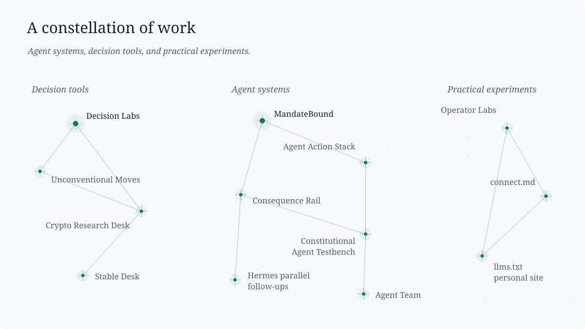
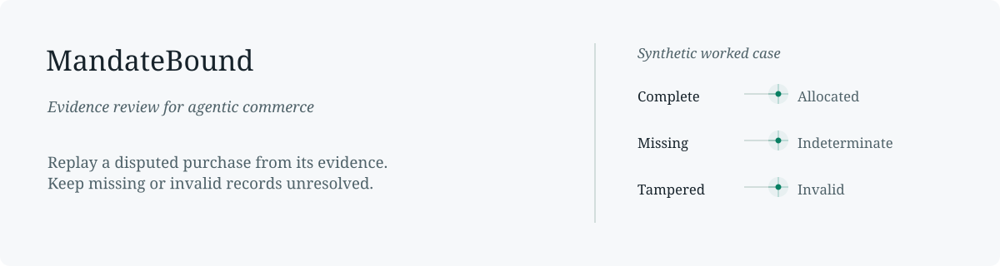
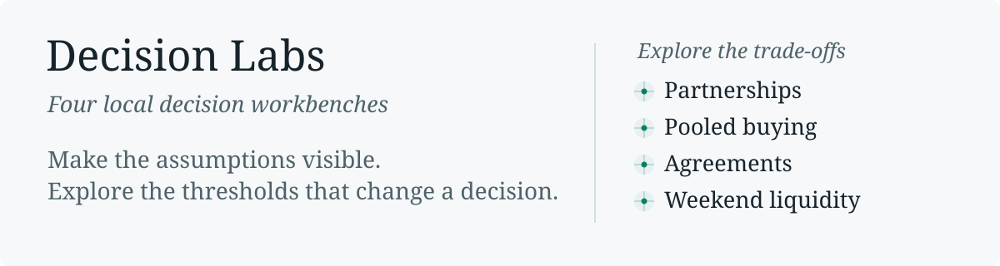
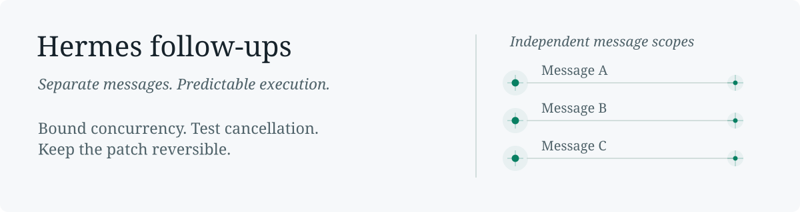

<picture>
  <source media="(prefers-color-scheme: dark)" srcset="assets/banner-dark.svg">
  <source media="(prefers-color-scheme: light)" srcset="assets/banner-light.svg">
  
</picture>

  <a href="https://danieloon.ai">Website</a> &nbsp;·&nbsp; <a href="https://www.linkedin.com/in/danieloon">LinkedIn</a> &nbsp;·&nbsp; <a href="https://x.com/EauDoon">@EauDoon</a>

I build tools for agent systems and business decisions, with explicit rules, recoverable actions, and evidence you can inspect.

<a href="docs/CATALOG.md">
<picture>
  <source media="(max-width: 600px) and (prefers-color-scheme: dark)" srcset="assets/constellation-mobile-dark.svg">
  <source media="(max-width: 600px)" srcset="assets/constellation-mobile-light.svg">
  <source media="(prefers-color-scheme: dark)" srcset="assets/constellation-dark.svg">
  
</picture>
</a>

## Selected work

<a href="https://github.com/EauDoon/mandatebound">
<picture>
  <source media="(max-width: 600px) and (prefers-color-scheme: dark)" srcset="assets/mandatebound-mobile-dark.svg">
  <source media="(max-width: 600px)" srcset="assets/mandatebound-mobile-light.svg">
  <source media="(prefers-color-scheme: dark)" srcset="assets/mandatebound-dark.svg">
  
</picture>
</a>

[Repository](https://github.com/EauDoon/mandatebound) &nbsp;·&nbsp; [Worked example](https://github.com/EauDoon/mandatebound/blob/main/docs/CASE_STUDY.md)

 

<a href="https://github.com/EauDoon/decision-labs">
<picture>
  <source media="(max-width: 600px) and (prefers-color-scheme: dark)" srcset="assets/decision-labs-mobile-dark.svg">
  <source media="(max-width: 600px)" srcset="assets/decision-labs-mobile-light.svg">
  <source media="(prefers-color-scheme: dark)" srcset="assets/decision-labs-dark.svg">
  
</picture>
</a>

[Repository](https://github.com/EauDoon/decision-labs) &nbsp;·&nbsp; [Worked example](https://github.com/EauDoon/decision-labs/blob/main/docs/CASE_STUDY.md)

 

<a href="https://github.com/EauDoon/hermes-parallel-followups">
<picture>
  <source media="(max-width: 600px) and (prefers-color-scheme: dark)" srcset="assets/hermes-followups-mobile-dark.svg">
  <source media="(max-width: 600px)" srcset="assets/hermes-followups-mobile-light.svg">
  <source media="(prefers-color-scheme: dark)" srcset="assets/hermes-followups-dark.svg">
  
</picture>
</a>

[Repository](https://github.com/EauDoon/hermes-parallel-followups) &nbsp;·&nbsp; [Worked example](https://github.com/EauDoon/hermes-parallel-followups/blob/main/docs/CASE_STUDY.md)

Experimental software and synthetic worked cases. These checks do not establish customer adoption, production reliability, or business impact.

 

<strong>Browse the project index</strong>

### Agent infrastructure

- **[Agent Action Stack](https://github.com/EauDoon/agent-action-stack)** connects policy checks, action recovery, and dispute evidence in a runnable synthetic reference path.
- **[Consequence Rail](https://github.com/EauDoon/consequence-rail)** provides recourse-gated execution, recovery preflight, and signed settlement receipts.
- **[Constitutional Agent Testbench](https://github.com/EauDoon/constitutional-agent-testbench)** checks structured agent responses against policy rules with deterministic precedence traces.
- **[Agent Team](https://github.com/EauDoon/agent-team-os)** is a reusable skill for bounded specialist workflows, evidence handoffs, and independent review.

### Decision methods

- **[Unconventional Moves](https://github.com/EauDoon/unconventional-moves)** is a decision skill for comparing practical approaches and planning reversible experiments.
- **[Crypto Research Desk](https://github.com/EauDoon/crypto-research-desk)** combines research-only workflows with a browser workbench for evidence packets and independent risk review.

### Experiments and examples

- **[Operator Labs](https://github.com/EauDoon/operator-labs)** contains two offline Python tools for synthetic payment-route comparison and OTLP privacy-regression checks.
- **[llms-txt-personal-site](https://github.com/EauDoon/llms-txt-personal-site)** is a static-site template with Markdown, llms.txt, JSON-LD, and reproducible build checks.
- **[connect.md](https://github.com/EauDoon/connect.md)** supports local Markdown profile and resume drafting, preview, session recovery, and exports. Optional network services require separate deployment.
- **[Stable Desk](https://github.com/EauDoon/stable-desk)** is a browser-local stablecoin research workbench with a synthetic baseline and human-reviewed decisions. Exported files are its backups; hosted source identity is unverified. No license has been selected, so public visibility does not grant reuse permission.

### Fork contribution

**[Reflection Engine](https://github.com/EauDoon/reflection-engine)** adds a bounded prompt and offline source-preparation and review tools to [Kevin Rose's original](https://github.com/kropdx/reflection-engine). The original prompt and attribution are preserved. Other assessed forks are labeled separately in the catalog.

[Full project catalog](docs/CATALOG.md) &nbsp;·&nbsp; [Search and setup](docs/DISCOVERY.md) &nbsp;·&nbsp; [Review workflows](docs/WORKFLOWS.md)

The catalog is a dated source snapshot. Repository licenses and upstream attribution define reuse.
